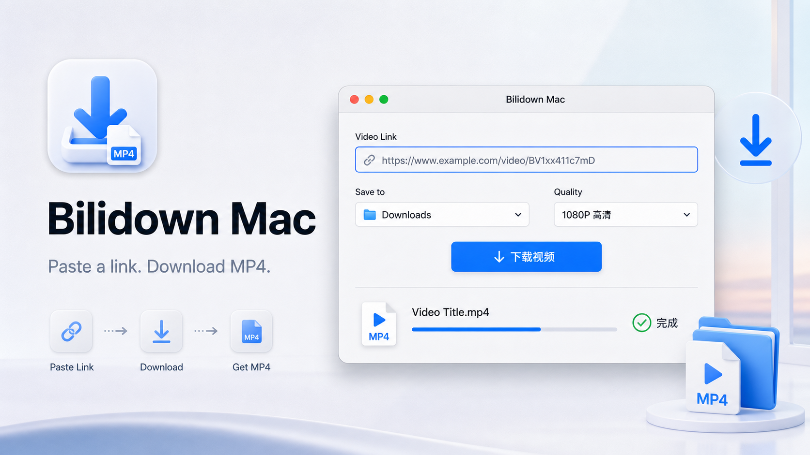
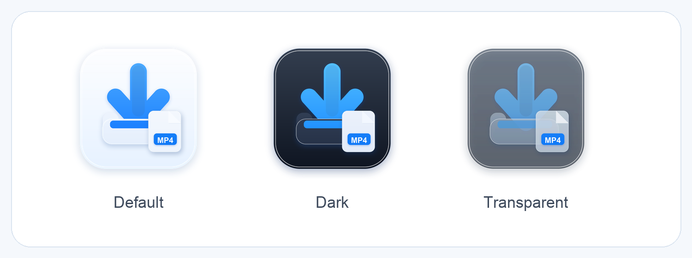

# Bilidown Mac



这是一个 macOS 版 B 站视频下载工具。可以直接打开图形 App 输入链接下载，也可以用命令行工作流调用。

当前版本已经内置专属 App 图标，并在图形界面中加入了轻量的 macOS 玻璃材质效果。图标包含默认、深色、透明三种外观，App 内可以选择“自动 / 默认 / 深色 / 透明”。

## 图形 App

运行：

```bash
./script/build_and_run.sh
```

App 功能：

- 输入 B 站视频链接
- 选择保存文件夹
- 选择清晰度：最佳、1080p、720p、仅音频
- 点击“下载视频”后输出到所选目录
- 默认不读取 Chrome Cookie；需要登录后高清资源时，勾选“使用 Chrome Cookie”

构建脚本会生成并启动：

```text
dist/BilidownMac.app
```

Codex 里也配置了 Run action，可以直接点 Run 启动。

## Web 版

运行：

```bash
./script/run_web.sh
```

打开：

```text
http://127.0.0.1:4789
```

Web 版功能：

- 输入 B 站视频链接
- 选择清晰度
- 勾选是否使用 Chrome Cookie
- 勾选是否下载全部分 P / 合集
- 点击“选择文件夹”打开 macOS 原生文件夹选择窗口
- 点击“下载视频”后由本机后端调用 `mac-bilidown/bin/bilidown`

说明：这个 Web 只绑定在 `127.0.0.1`，也就是只给本机访问。它不会把 Cookie 或链接上传到外部服务器。

### 打包 Web 版

生成一个可以直接发给别人的文件夹：

```bash
./script/package_web.sh
```

打包结果：

```text
dist/BilidownWeb
```

把整个 `dist/BilidownWeb` 文件夹发给别人。对方在 Mac 上双击：

```text
启动 Bilidown Web.command
```

即可打开本地 Web 页面。这个文件夹内置 Node.js、`yt-dlp` 和 `ffmpeg`，支持 Apple Silicon 和 Intel Mac。

App 图标资源位于：

```text
Assets/AppIcon.icns
Assets/AppIcon.png
Assets/AppIconDark.icns
Assets/AppIconDark.png
Assets/AppIconTransparent.icns
Assets/AppIconTransparent.png
```

预览：



需要重新生成图标资源时运行：

```bash
./script/generate_app_icons.py
```

## 命令行

```bash
./mac-bilidown/bin/bilidown doctor
./mac-bilidown/bin/bilidown download "https://www.bilibili.com/video/BV..."
```

默认输出目录：

```text
~/Downloads/Bilidown
```

完整说明见：

- [中文使用说明](./mac-bilidown/使用说明.md)
- [English README](./mac-bilidown/README.md)

核心 CLI 实现位于 [`mac-bilidown`](./mac-bilidown)：

- `bin/bilidown`：命令行入口
- `vendor/darwin-arm64`：Apple Silicon 依赖
- `vendor/darwin-x64`：Intel Mac 依赖
- `scripts/fetch-vendor-deps.zsh`：依赖修复/重拉脚本

## 说明

下载能力基于 `yt-dlp` 的 Bilibili extractor 和内置 macOS `ffmpeg`。
